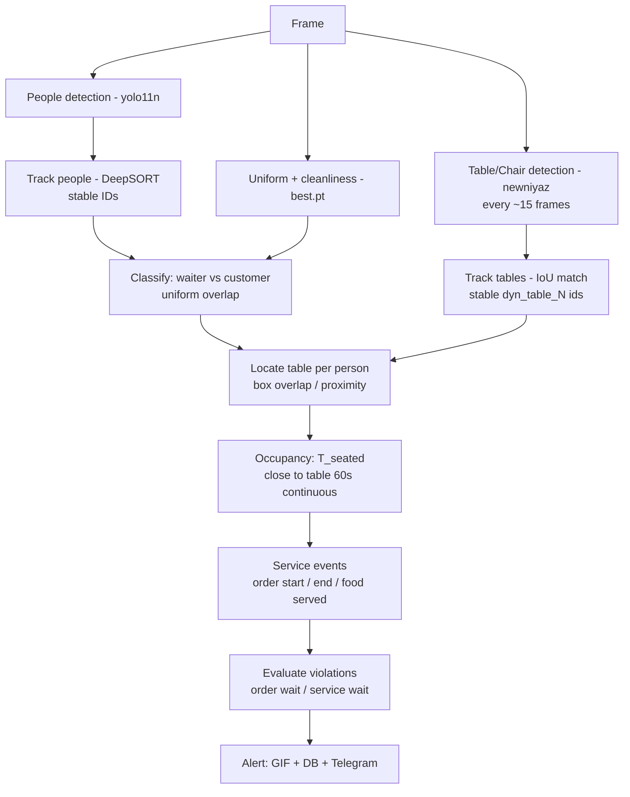

# Service Discipline Monitor — How It Works

**Module:** `modules/service_discipline_monitor.py`
**Purpose:** Measure restaurant **table-service timing** from CCTV — how long a seated
customer waits for their **order to be taken** and for **food to be served** — and raise
alerts when service is too slow.
**Runs on:** 13 cameras (restaurant/dining views).

---

## 1. What it produces

For every customer who sits at a table, the module reconstructs a four-event service
timeline and derives two wait metrics from it:

| Metric | Definition | Meaning |
|---|---|---|
| **Order wait** | `T_order_start − T_seated` | Time from sitting down until a waiter takes the order |
| **Service wait** | `T_food_served − T_order_start` | Time from ordering until food is served |

These two metrics drive the alerts (Section 6).

---

## 2. Models used

Three detectors run per camera:

| Model | Role | Details |
|---|---|---|
| `models/yolo11n.pt` | **People detection** | Standard COCO model; detects every person (class 0). Feeds the tracker. |
| `models/best.pt` | **Uniform + cleanliness** | Custom 22-class model. Uniform colours + `Hairnet` → identify staff; `Table_clean` / `Table_unclean` → cleanliness. |
| `models/newniyaz.pt` | **Furniture (tables)** | Custom model with classes `Chair`, `Sofa`, `Table`. Detects tables dynamically, replacing fixed ROIs. |

---

## 3. Per-frame pipeline

Each processed frame passes through these stages **in order**. Stages 1–4 establish
*who* and *where*; stages 5–8 turn that into service timing and alerts.



### Stage 1 — Detect
Run all three models: **people** (yolo11n), **uniforms & cleanliness** (best.pt), and
**tables/chairs** (newniyaz). Table detection runs on a light cadence (**every ~15
frames**, `table_detect_interval`) because furniture is near-static — this keeps the
extra model cheap.

### Stage 2 — Track
- **People** are tracked with **DeepSORT**, giving each person a **stable ID across
  frames** — essential because the module must time individuals over minutes.
- **Tables** are tracked by **IoU-matching** detections frame-to-frame into stable IDs
  (`dyn_table_N`), persisting ~30 s after last seen. This means a physical table keeps
  its identity (and its per-table timers) even if a frame misses it.

### Stage 3 — Classify: waiter vs customer
A tracked person is a **waiter** if a server uniform (`Uniform_black/grey/cream/blue/brown`)
or `Hairnet` overlaps their bounding box; otherwise a **customer**. A short memory
(~3 s / 90 frames) prevents flicker, and the type can flip if the person is consistently
seen otherwise.

### Stage 4 — Locate table (dynamic, no ROI)
A person is matched to the tracked table whose box they **overlap or are very close to**
(gap `< 0.35 × person height`), preferring the strongest overlap. A nearby `Chair`/`Sofa`
raises confidence.

- This **replaces fixed table ROIs**, so monitoring stays correct when tables are
  physically **rearranged**.
- If no table is detected for a person, it **falls back to the ROI** point-in-polygon
  check automatically (so nothing breaks on cameras the model can't cover).
- Toggle with env `SERVICE_DYNAMIC_TABLES=0` to force pure-ROI behaviour.

### Stage 5 — Occupancy → `T_seated`
A customer is counted as **occupying a table** only after staying close to it
**continuously for ~60 seconds** (`seated_dwell_seconds`).

- A **5-second grace** (`seated_grace_seconds`) absorbs brief detection flicker / bbox
  jitter, so a single dropped frame does **not** reset the one-minute timer. The timer
  only resets if the customer is away from **all** tables longer than the grace window.
- This filters out people merely **passing by** or standing near a table.
- When `T_seated` is recorded, the **order-wait clock starts**.

### Stage 6 — Service events
Waiter–customer proximity drives the remaining timestamps:

| Event | Condition |
|---|---|
| `T_order_start` | A **waiter** comes within `1.5 × customer height` (`interaction_distance_factor`) and stays for **2 s** (`interaction_duration`) |
| `T_order_end` | The waiter **leaves** (gone ≥ `interaction_grace_seconds` ≈ 1.5 s) |
| `T_food_served` | A waiter **returns** to the table later (after `food_served_gap` ≈ 10 s) |

### Stage 7 — Evaluate violations
Compare the two wait metrics against thresholds (Section 6). Violations are **one-shot per
customer**, respect a **per-table cooldown**, and are **suppressed while a table is flagged
unclean**.

### Stage 8 — Alert & record
On a confirmed violation:
- Record a **3-second GIF** of the event (`AlertGifRecorder`),
- Write the violation to the **database**,
- Optionally send a **Telegram** notification.

The dashboard reads violations from the database.

---

## 4. The service timeline

```
   T_seated            T_order_start   T_order_end        T_food_served
      |========ORDER WAIT========>|          |====SERVICE WAIT====>|
      |   (alert if > 5 min)      |          |  (alert if > 10 min)|
      o---------------------------o----------o---------------------o----> time
  customer near              waiter        waiter            waiter returns
  table >= 60s               interacts     leaves            with food
```

- **Order wait** = `T_order_start − T_seated`
- **Service wait** = `T_food_served − T_order_start`

---

## 5. Waiter vs customer, and table membership — kept independent

- **Who is staff** is decided by **appearance** (uniform / hairnet overlap).
- **Which table a person belongs to** is decided by **geometry** (box proximity to a
  detected table).

Because these are independent, a uniformed staff member standing near a table is **never**
mistaken for a seated customer.

---

## 6. Violation rules

| Violation | Fires when | Threshold | Severity |
|---|---|---|---|
| `order_wait` | Order not taken within the limit after the customer is seated | **300 s (5 min)** | Warning |
| `service_wait` | Once ordered, food not served within the limit | **600 s (10 min)** | Critical |

Rules:
- **One-shot per customer** (`order_alert_fired` / `service_alert_fired`) — no repeat spam.
- **Per-table cooldown** of **1800 s (30 min)** between the same alert type.
- **Suppressed for unclean tables** — cleanliness is tracked separately via
  `Table_unclean` (requires 3 consecutive frames); an unclean table is skipped in the
  violation loop.

---

## 7. Configuration (tunable)

Defaults live in `self.settings`; several are overridable via environment variables and/or
per-camera DB config.

| Setting | Default | Controls | Env override |
|---|---|---|---|
| `seated_dwell_seconds` | 60 s | Continuous time near a table before a customer counts as seated | `SERVICE_SEATED_DWELL_SECONDS` |
| `seated_grace_seconds` | 5 s | Allowed brief separation before the dwell timer resets | `SERVICE_SEATED_GRACE_SECONDS` |
| `interaction_duration` | 2 s | Waiter must stay near the customer this long to count as interaction | — |
| `interaction_distance_factor` | 1.5× | "Near" distance, scaled to customer height | — |
| `interaction_distance_min_px` | 80 px | Absolute floor for tiny bounding boxes | — |
| `food_served_gap` | 10 s | Gap before a return visit counts as food served | — |
| `order_wait_threshold` | 300 s | Order-wait violation limit | (DB config) |
| `service_wait_threshold` | 600 s | Service-wait violation limit | (DB config) |
| `alert_cooldown` | 1800 s | Minimum gap between same-type alerts per table | (DB config) |
| `table_detect_interval` | 15 frames | How often the table model re-runs | `SERVICE_TABLE_DETECT_INTERVAL` |
| Dynamic tables on/off | on | Use detected tables vs pure ROI | `SERVICE_DYNAMIC_TABLES` (`0` = ROI only) |
| Require chair near table | off | Only treat a table as seating if a chair is nearby | `SERVICE_REQUIRE_CHAIR` (`1` = require) |

---

## 8. Key design decisions

- **Dynamic tables instead of fixed ROIs.** Table locations are detected live and tracked
  to stable IDs rather than hand-drawn ROIs, so rearranging furniture no longer breaks
  monitoring. ROIs remain an automatic fallback where the model detects nothing.
- **Occupancy needs a sustained minute, with grace.** A customer must stay near a table
  for a continuous minute before the service clock starts (filters passers-by), while a
  short grace window keeps a one-frame detection drop from resetting the count.
- **Appearance for identity, geometry for location.** Staff detection (uniform) and table
  membership (proximity) are decoupled, avoiding staff-as-customer errors.

---

## 9. Known limitations

- **Table detection depends on model coverage.** On some camera angles / lighting the
  table model under-detects (misses tables obvious to a person). Those cameras rely on the
  ROI fallback until the model is retrained on frames from the real cameras.
- **Timing needs adequate frame rate.** The 1-, 5-, and 10-minute timers require the same
  person to keep a stable DeepSORT ID for minutes, which needs a healthy frame rate. Below
  ~2 fps, identity churns and time-based violations under-fire — addressed by running
  cameras across multiple worker processes (camera sharding).

---

## 10. Data flow summary

```
detect (3 models) → track (persons + tables) → classify (waiter/customer)
   → locate table (dynamic, ROI fallback) → occupancy (T_seated, 60s dwell)
   → service events (order start/end, food served) → violations (order/service wait)
   → alert (GIF + DB + Telegram)
```

**One line:** detect people, staff (by uniform), and tables (dynamically); when a customer
sits at a table for a minute, time how long until the order is taken and food is served,
and alert if those exceed 5 min / 10 min.
